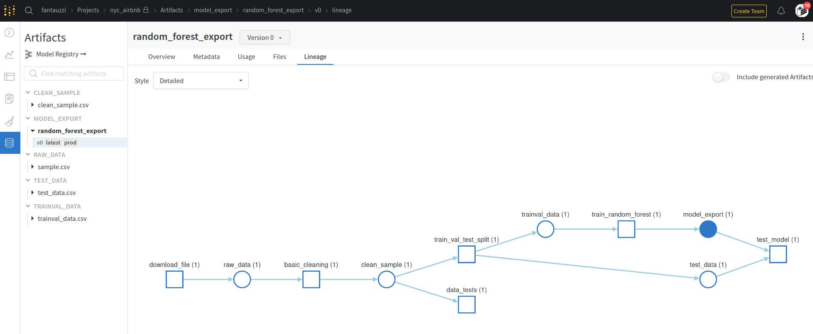

# Build an ML Pipeline for Short-Term Rental Prices in NYC
The machine learning pipeline estimates the typical price for a given property based 
on the price of similar properties in NYC, USA. The (fictional) company receives new data in bulk every week. The 
model needs to be retrained with the same cadence, necessitating an end-to-end pipeline that can be reused.

## Installation

Clone the GitHub repository

`git clone https://github.com/fantauzzi/ml-pipeline-for-short-term-rental-prices`

`cd` into the root of the repo

`cd ml-pipeline-for-short-term-rental-prices`

To run all the steps of the pipeline, except the EDA and `test_regression_model`, enter

`mlflow run .`

To run the EDA in a Jupyter notebook, enter

`mlflow run src/eda`

To run one or more specific steps (e.g. `train_random_forest` and `test_regression_model`):

`mlflow run . -P steps="train_random_forest,test_regression_model"`

Available steps in the pipeline are:
- download
 - basic_cleaning
 - data_check
 - data_split
 - train_random_forest
 - test_regression_model

Here an example on how to run the training step with a Hydra swipe, to test different values for given hyper-parameters.
With the `hydra/launcher=joblib` option, the command will spawn one job (process) for every combination of 
hyper-parameter values to be evaluated.

`mlflow run . -P steps="train_random_forest" -P hydra_options="hydra/launcher=joblib modeling.max_tfidf_features=10,15,30 modeling.random_forest.max_features=0.1,0.33,0.5,0.75,1 -m"`

*Note:* Before running it, it is convenient to run the `train_random_forest` step at least once without a swipe, to have MLFlow build the 
needed conda environment. Contrariwise, when running the swipe, each job will try to configure its own
conda environment, all the jobs at the same time, which may well deplete the available memory.

This is the complete pipeline as depicted by Weights & Biases.

## References

The [public project](https://wandb.ai/fantauzzi/nyc_airbnb) on Weights & Biases.

[Releases]() for this GitHub project

## License

Skeleton code from Udacity's *Machine Learning Devops Engineer* course.

[License](LICENSE.txt)
